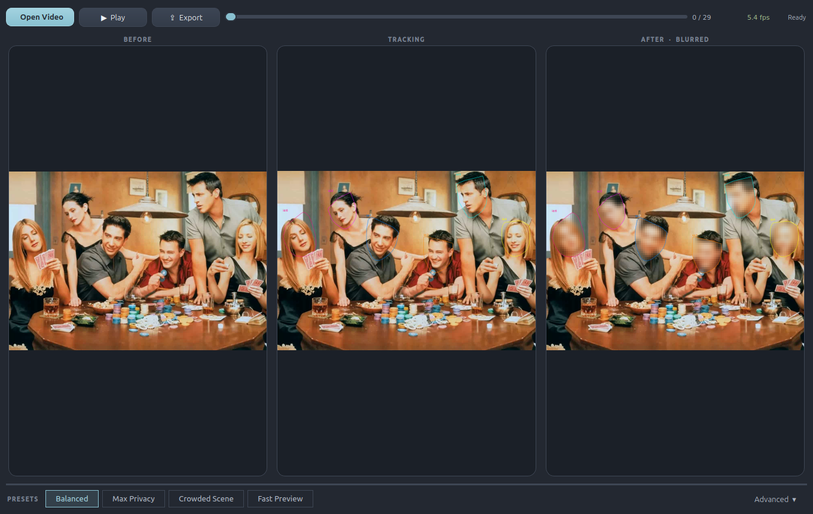
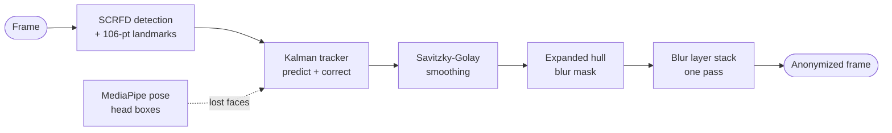
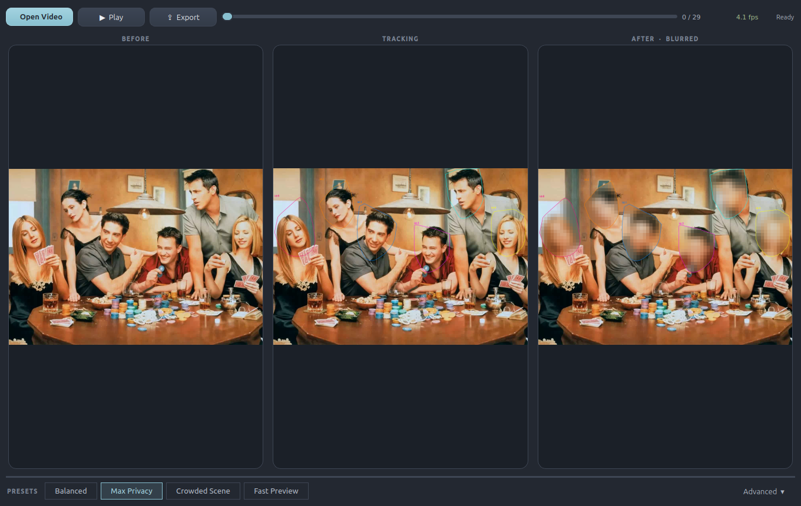
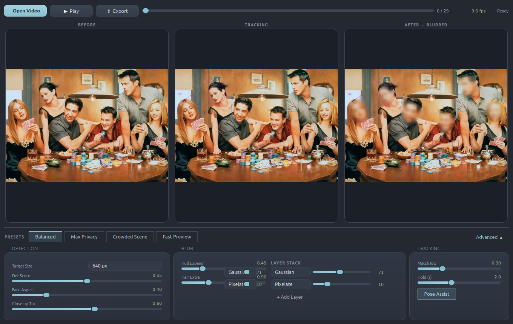
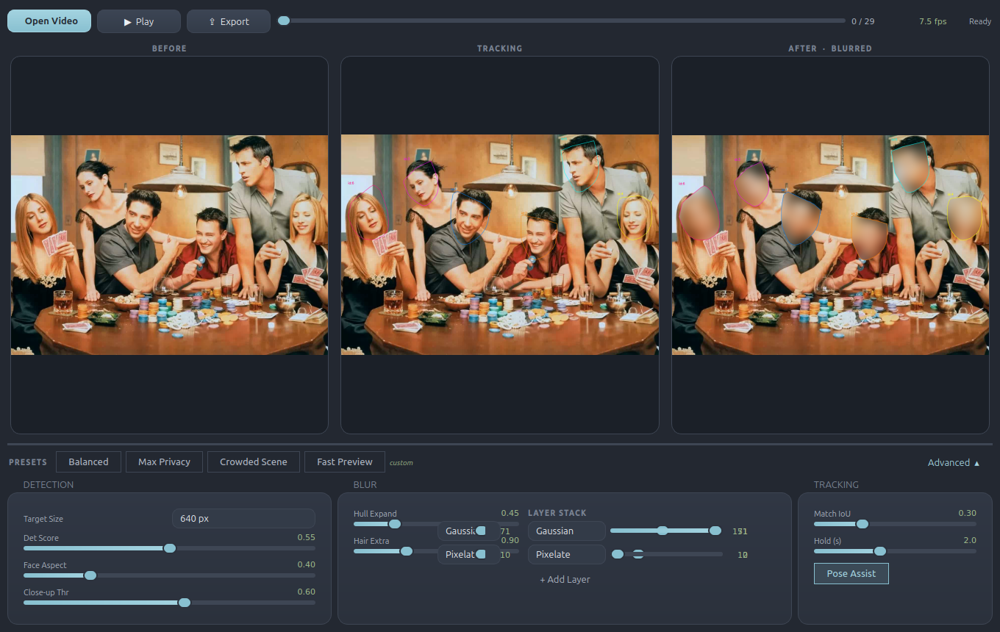
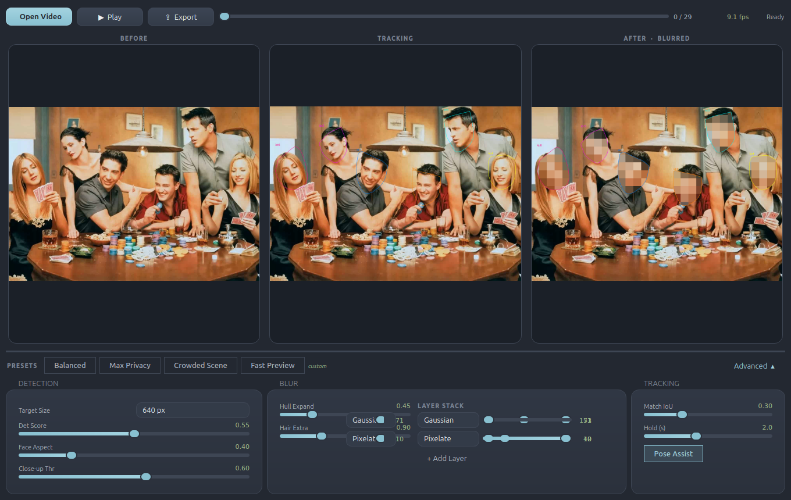
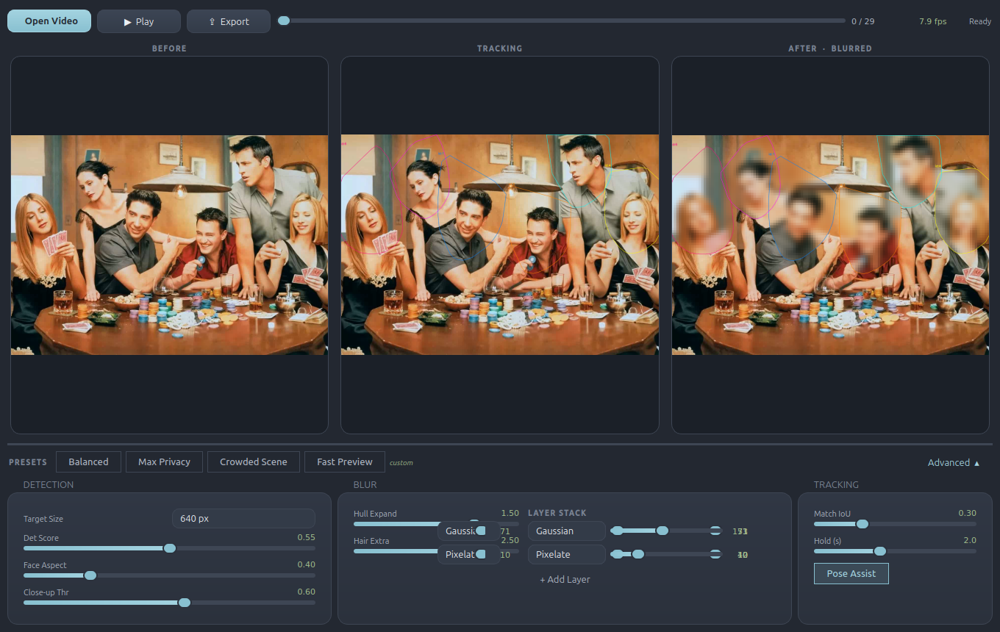

<div align="center">

# Automated Video Privacy Pipeline

On-device face anonymization for video: detect, track, blur. Comes with a
live inspector for tuning every step before you export.

[](LICENSE)
[](pyproject.toml)
[](src/ui.py)
[](src/libs/utils.py)
[](#privacy-by-design)



</div>

---

This tool finds every face in a video, follows it across frames, and paints an
irreversible Gaussian and mosaic blur over it, entirely on your machine.
Nothing is uploaded, ever.

## Features

- **Three-panel live inspector.** Before, Tracking, and After side by side, so
  you see exactly what the pipeline sees and exactly what gets exported. The
  Tracking panel overlays the MediaPipe pose skeleton and the coarse head box fed
  to the tracker, so you can watch pose assist keep a lost face covered.
- **Presets first, sliders when you want them.** Pick a preset chip for the
  common cases, or open the Advanced panel for full control of every tunable.
  Changes re-render the current frame live.
- **Real tracking, not per-frame detection.** InsightFace SCRFD detection with
  106-point landmarks feeds a per-face Kalman filter; detections correct it,
  and when the detector loses a face (head turn, looking down, occlusion) the
  track coasts on prediction so the blur never flickers off. Body-pose head
  estimation (MediaPipe) revives lost tracks even when no face is visible.
- **Stackable blur layers.** Add, remove and reorder Gaussian and pixelate
  passes to taste. The default is the classic combo: Gaussian first, mosaic
  on top.
- **Landmark-fitted masks.** The blur region is an expanded convex hull of the
  face landmarks, with extra headroom for the hairline, not a crude box.
- **Pause mid-export and retune.** Exports re-read the sliders every frame:
  pause, adjust, watch the held frame update, resume.
- **GPU where it helps.** ONNX Runtime picks DirectML, then CUDA, then CPU
  automatically; the blur pass runs on CUDA via PyTorch when available.

## How it works



Close-up faces (filling most of the frame) are automatically re-detected on an
upscaled crop for tighter landmarks. When the detector loses a face, its
Kalman filter keeps predicting the head's position for **Hold (s)** seconds,
and the last landmark hull rides along with the predicted box, so the blur
follows someone who turns away or looks down instead of switching off. With
**Pose Assist** on, MediaPipe body pose supplies coarse head boxes that keep
correcting a lost track for as long as the person is visible, even from
behind.

## Install

Requires Python 3.12+ and [uv](https://docs.astral.sh/uv/).

```bash
git clone <this-repo>
cd automated-video-privacy-pipeline
uv sync
```

> First run downloads the InsightFace `buffalo_l` model pack (~300 MB) to
> `~/.insightface`, and the first frame that needs Pose Assist fetches the
> MediaPipe pose model (~5 MB) to `~/.faceblur`. Everything after that is
> fully offline.

## Quick start

**GUI inspector** (recommended):

```bash
uv run python src/main.py
```

**Headless CLI** for batch jobs:

```bash
uv run python src/main.py --input talk.mp4 --output talk_blurred.mp4
```

| Flag | Default | Meaning |
| --- | --- | --- |
| `--input` | `0` | Video path, or a webcam index |
| `--output` | (none) | Write the blurred video here |
| `--target-size` | `640` | Detector input size; `1024` for offline accuracy |
| `--no-display` | off | Skip the preview window |
| `--no-pose` | off | Disable pose-assisted head tracking for lost faces |
| `--hold-secs` | `2.0` | Keep blurring a lost face this long on Kalman prediction |

## Windows build

`build_exe.sh` produces a standalone `dist/FaceBlurInspector.exe` (single
file, no console window). Run it from WSL2; it drives the Windows Python
interpreter through WSL interop so PyInstaller emits a native executable:

```bash
./build_exe.sh
```

You need a Windows Python 3.10-3.13 on the host (boxmot does not support
3.14+). Models are still downloaded on first launch, not bundled.

## Using the inspector

1. **Open Video** and scrub the timeline. All three panels update live.
2. Pick a **preset**, or open **Advanced** and drag sliders; the current
   frame re-renders so you can judge the result immediately.
3. **Export**: choose a destination and watch progress frame by frame.
   **Pause** any time to retune on the held frame, then **Resume**.

### Presets

<div align="center">

</div>

| Preset | Use it for |
| --- | --- |
| **Balanced** | Sensible defaults for most footage |
| **Max Privacy** | Catch every face and blur hard; favours coverage over speed |
| **Crowded Scene** | Many small faces; high-res detection and stricter ID matching |
| **Fast Preview** | Quick scrubbing on CPU while you find the right moment |

Touch any slider and the chips deselect: you're in **custom** territory, shown
next to the preset row.

### Advanced: every tunable

<div align="center">

</div>

## Tuning guide

### Tracking faces better

| Tunable | Default | Range | What it does |
| --- | --- | --- | --- |
| **Target Size** | 640 | 320-1024 | Detector input resolution. The single biggest lever: small or distant faces need `1024`; drop to `320` for speed. |
| **Det Score** | 0.55 | 0.10-1.00 | Minimum detection confidence. *Lower* to catch blurry, tilted or partially hidden faces; *raise* if non-faces get blurred. |
| **Face Aspect** | 0.40 | 0.10-1.50 | Minimum width/height ratio a box must have to count as a face. *Lower* to keep extreme profile views; *raise* to reject tall false positives. |
| **Close-up Thr** | 0.60 | 0.10-1.00 | Frame-area fraction above which a face is re-detected on an upscaled crop. *Lower* it for interview/talking-head footage to get tighter landmarks. |
| **Match IoU** | 0.30 | 0.05-0.95 | Overlap required to attach a detection to an existing track. *Lower* if IDs flicker on fast motion; *raise* if IDs swap between people in crowds. |
| **Hold (s)** | 2.0 | 0-5 | How long a lost face keeps its blur, coasting on Kalman prediction, before the track is dropped. |
| **Pose Assist** | on | n/a | Track the head via body pose when the face detector loses it (head turns, looking down), keeping the track corrected indefinitely while the person is visible. |

### Blurring videos better

| Tunable | Default | Range | What it does |
| --- | --- | --- | --- |
| **Hull Expand** | 0.45 | 0-2 | Grows the landmark hull outward in every direction. Raise if ears or jawlines peek out. |
| **Hair Extra** | 0.90 | 0-3 | Additional *upward* growth above the face centroid. Raise to cover hairlines, hats and hoods. |
| **Layer Stack** | Gaussian 71, then Pixelate 10 | up to 5 layers | Ordered blur passes applied in sequence. Gaussian strength is the kernel size (3-151, odd); Pixelate strength is the mosaic cell size (2-40). Stack more layers for harder anonymization. |

| Soft Gaussian wash | Heavy pixelation | Wide mask coverage |
| --- | --- | --- |
|  |  |  |
| `Gaussian K 151, Block 2` | `Gaussian K 3, Block 40` | `Hull Expand 1.5, Hair Extra 2.5` |

### Recipes

- **Faces slipping through?** Target Size `1024`, Det Score `0.35`, Face
  Aspect `0.25`. Recall first; tighten afterwards if false positives appear.
- **IDs swapping in a crowd?** Match IoU `0.45`+ and keep Target Size high so
  small faces produce stable boxes.
- **Identity still readable after blur?** Raise Pixelate Block before Gaussian
  K. Mosaic size is what defeats deblurring; the Gaussian only feeds it.
- **Hoodies or hair still visible?** Hair Extra `1.5`+, then Hull Expand. The
  *Max Privacy* preset is exactly this dial-up.
- **Export too slow?** Tune on *Fast Preview*, then switch up to *Balanced* or
  *Max Privacy* right before exporting, or pause mid-export and adjust.

## Privacy by design

- All inference and rendering happen locally; the network is only touched to
  fetch the model packs, once each.
- Blur is destructive (a flat-color mosaic over a Gaussian wash), not a
  reversible filter.
- Occlusion handling errs on the side of coverage: when detection drops out,
  the last known mask is held rather than removed.

## Project structure

```
src/
  main.py            entry point; dispatches to the GUI or the CLI
  splash.py          lightweight splash screen shown while heavy imports load
  cli.py             headless pipeline for batch jobs
  ui.py              the inspector (PyQt6): presets, panels, export
  libs/
    face_app.py      minimal InsightFace loader (DirectML-safe)
    tracker.py       Kalman face tracker with detection-gap coasting
    pose_head.py     MediaPipe pose to head boxes, for lost-track revival
    smoother.py      Savitzky-Golay landmark smoother with occlusion hold
    utils.py         hull masks + stackable blur layers + mask continuity
    video_writer.py  streaming ffmpeg exporter (handles >4 GiB output)
scripts/
  capture_screenshots.py   regenerates the README screenshots, headless
build_exe.sh         standalone Windows .exe via PyInstaller (run from WSL2)
```

## Contributing

Issues and PRs welcome. `uv sync`, make your change, and include a screenshot
if it touches the UI. `scripts/capture_screenshots.py` regenerates the full
set headlessly:

```bash
QT_QPA_PLATFORM=offscreen uv run python scripts/capture_screenshots.py
```

## License

[MIT](LICENSE) © 2026 Kabir S. Tamari
