<div align="center">

# Automated Video Privacy Pipeline

On-device head anonymisation for video: detect with every model you have,
track with a long memory, refine offline, review on a timeline, blur.

[](LICENSE)
[](pyproject.toml)
[](src/app/window.py)
[](src/libs/utils.py)
[](#privacy-by-design)

</div>

---

This tool finds every head in a video, follows it across frames, and paints an
irreversible pixelate-over-Gaussian blur over it, entirely on your machine.
Nothing is uploaded, ever.

It is built for footage where face detectors fail constantly: bodies at every
angle, faces upside down or in profile, hair and hands in the way, bad light,
lots of skin. On that footage a missed head is a real harm and a blurred knee
is a cosmetic one, so the whole pipeline is **recall-first**:

- **any** detector may propose a head; agreement between detectors raises
  confidence, disagreement never vetoes;
- a tracked head stays blurred until it is genuinely gone — no per-frame
  proof required, no timeouts while someone turns away;
- false positives are handled with *time* (a head persists, a fabric fold
  flickers) and with a **suspicion score** that sorts the review timeline,
  not with per-frame gates that also throw away real heads.

See [How it works](#how-it-works), [docs/DATAFLOW.md](docs/DATAFLOW.md) for the
per-stage dataflow, and [docs/TECH_STACK.md](docs/TECH_STACK.md) for the
measurements behind every design decision.

## Features

- **Union detection with rotation.** Three model families vote on every
  analysed frame: a dedicated YOLO11 head detector, the Wholebody17 head and
  face classes, and SCRFD faces with a landmark-plausibility check. Each head
  source also runs on 90°/180°/270°-rotated copies of the frame — on the
  reference clip that alone lifts head recall from 64 % to 94 %. Heads define
  the box; faces corroborate it, and a face no head detector covers still
  produces a head-sized blur. A fourth model, NudeNet, supplies the one
  thing the others cannot: body-part boxes that **veto** a head candidate
  sitting on a groin, belly or foot, however many head detectors agree.
  Unsupported claims that do not look like a head (3:1 aspect, rotated-only,
  frame-filling) are down-weighted so they can sustain a track but not start
  one.
- **Heads, not faces.** The unit of blur is the head: it does not stop
  existing when the person looks away. Face-tight mode is available and
  falls back to the head box, never to nothing.
- **Long-memory tracking, bidirectional refinement.** Kalman + BYTE
  association with a low spawn bar and a 2.5 s coast; then, offline with the
  whole timeline in hand: gaps bridged along the motion path (with an
  appearance veto so two people never merge), ends extended, positions
  smoothed with a zero-phase filter, boxes grown along their velocity so fast
  motion never outruns the blur.
- **Suspicion instead of deletion.** Every track gets a 0–1 suspicion score
  from what the pipeline can see — no second source ever agreed, weak or
  brief, static as a fabric fold, failed magnified re-detection, oversized —
  and the timeline lists the most suspicious first. Only the *Strict* preset
  auto-disables anything; *Max Privacy* disables nothing.
- **A timeline editor, not a dialog.** Scrub, play, click a box or a lane to
  select a track, toggle its blur with one key, split or trim it at the
  playhead. An **alert strip** marks every frame where a confident detection
  has no blur; `]` jumps to the next one. **Draw a box over a missed head
  and it follows the head** forward and backward — snapping to cached
  detections, template-matching where there are none — instead of a straight
  line between two keyframes.
- **Cheap iteration.** Detection results are cached in a sidecar next to the
  video. Tracking, refinement, scoring and rendering knobs re-run from that
  cache in seconds; only detection settings trigger a new pass. Review
  decisions and manual heads live in the same file.
- **Headless CLI** for batch work: analyse, inspect, export, dump.
- **Audio preserved**, **GPU where it helps** (DirectML, CUDA, MIGraphX;
  OpenCL blur on AMD/Intel), **Windows .exe** with every model bundled.

## How it works

```mermaid
flowchart LR
    A([Video]) --> B["Union detect<br/>head det ×4 rot · Wholebody ×4 rot · SCRFD ×2 rot · NudeNet body parts"]
    B --> C{{"Fuse<br/>heads cluster · faces corroborate · body-part veto · trust-weight"}}
    C --> D["Track<br/>Kalman · BYTE · 2.5 s memory"]
    D --> E[("Tracklets + raw candidates<br/>(cached sidecar)")]
    E --> F["Refine<br/>trim · soft prune · bridge · extend · smooth"]
    F --> G["Score<br/>suspicion 0–1 · magnified re-detect"]
    G --> H{{"Timeline review<br/>toggle · split · trim · draw"}}
    H --> I[Velocity-padded ellipse masks]
    I --> J[Blur stack, one GPU pass]
    J --> K([Anonymised MP4 + original audio])
```



**Pass 1** decodes the video once and, on every analysed frame, runs every
source and fuses their boxes into head candidates with provenance bits
(which sources, rotated or upright, face inside, agreement). The tracker
spawns from any candidate above a low bar and keeps a lost head as a bridge
candidate for seconds. Both the tracklets and the per-frame candidates are
written to `<video>.avpp2.json`.

**Offline**, with hindsight: coasted ends are trimmed; only tracklets with
essentially no temporal support are set aside (and even those stay in the
review list); gaps are bridged when the velocity-extrapolated landing point,
size ratio, a clear corridor and face appearance all agree; ends are held
0.3 s beyond the last measurement; positions are smoothed; everything is
interpolated back onto every frame. Each track is then scored.

**Review** happens on the timeline. **Pass 2** renders the blur table with no
inference at all and stream-copies the audio.

### Results on the reference clip

<!-- RESULTS -->
Measured against an independent consensus of every detector at every
rotation on every 20th frame of a 4-minute 720p clip (342 corroborated
heads, frame-filling boxes excluded), with the saved review decisions
untouched:

| Pipeline | Heads covered | Faces covered | Blur on/off transitions | Blurred area | Unsupported blur boxes |
| --- | --- | --- | --- | --- | --- |
| Previous, Balanced | 69.6 % | 93.4 % | 30 | 7.9 % | 5 / 267 |
| Previous, Max Privacy | 71.9 % | 93.6 % | 24 | 8.1 % | 7 / 280 |
| **This pipeline, Balanced** | **93.0 %** | **98.0 %** | **14** | 15.8 % | 95 / 547 |
| This pipeline, Max Privacy | 95.6 % | 98.4 % | 6 | 20.2 % | 179 / 715 |
| This pipeline, Strict | 88.9 % | 97.5 % | 14 | 13.6 % | 64 / 464 |

The previous pipeline missed roughly one head in three — exactly the heads
without a visible face, which its gate required by construction — and
switched the blur on and off twice as often. The new one blurs about twice
the area: partly because heads on this footage are large and now all
covered, partly because some tracks are false. Those are what the review
timeline is for; with the verifier on, the top of the *Balanced* list is
dominated by tracks flagged `bodypart`, `unverified` and `lonely`, which is
the intended ordering. The residual that no automation catches is a
harness-covered groin all four models call a face — it is listed with its
34 % frame share in its lane label.

Measured on this 12-core CPU box with the 0°/180° rotation set at every 2nd
frame, pass 1 took 324 ms per analysed frame (head detector 180, Wholebody
73, SCRFD 71); rendering ran at 29 fps. The GPU path is an order of
magnitude faster on every model.

## Install

Requires Python 3.12+ and [uv](https://docs.astral.sh/uv/).

```bash
git clone <this-repo>
cd automated-video-privacy-pipeline
uv sync
```

> First run downloads five ONNX models into `~/.cache/avpp/`: the YOLO11-L
> head detector (~101 MB), the Wholebody17 detector (~28 MB, published inside
> a ~1.9 GB archive of which one member is kept), SCRFD (~17 MB), the ArcFace
> embedder (~14 MB) and NudeNet (~12 MB, body-part veto). The Windows
> .exe bundles all five and never downloads anything. Everything is offline
> after that.

### GPU acceleration (AMD, NVIDIA, Intel)

**This is the single biggest thing you can do for speed.** Pass 1 runs up to
ten model calls per analysed frame (four rotations of two head detectors,
two of SCRFD). Inference goes through ONNX Runtime, which picks the best
execution provider automatically: **DirectML** (any Windows GPU) → CUDA →
**MIGraphX** → ROCm → CPU.

`pyproject.toml` pins the stock `onnxruntime` wheel, which is **CPU-only**, so
a plain `uv sync` gives you a CPU pipeline on every platform. Install the
right wheel for your platform:

```bash
# Windows — any GPU (AMD / NVIDIA / Intel)
uv pip uninstall onnxruntime && uv pip install onnxruntime-directml

# NVIDIA, any OS
uv pip uninstall onnxruntime && uv pip install onnxruntime-gpu
```

**AMD on native Linux (ROCm).** From ROCm 7.1 onward AMD ships the
**MIGraphX** execution provider, and it needs the ROCm math libraries — a bare
`rocm-hip-runtime` install is not enough:

```bash
sudo apt install rocblas miopen-hip migraphx           # the math libs
uv pip uninstall onnxruntime
uv pip install onnxruntime-migraphx \
  --find-links https://repo.radeon.com/rocm/manylinux/rocm-rel-7.2.3/
```

Use `--find-links`, not `--index-url` (that URL is a directory of wheels, not
a PEP 503 index). Match the `rocm-rel-X.Y.Z` to your installed ROCm.

Verify with:

```bash
uv run python -c "import onnxruntime as ort; print(ort.get_available_providers())"
```

> **A listed provider is not a working one.** ONNX Runtime advertises an
> execution provider whenever its plugin ships in the wheel, without checking
> that the plugin's dependencies resolve. The pipeline preloads ROCm's math
> libraries itself and drops any provider whose plugin will not actually
> load, so a broken GPU install falls back to a plain fp32 CPU path instead
> of a half-converted fp16 one.

MIGraphX compiles each graph ahead of time (~25 s per model on first use);
compiled graphs are cached in `~/.cache/avpp/migraphx/`.

> **Do not create and discard model sessions.** Every model here is built once
> per process and never rebuilt, which the code enforces. Churning sessions
> aborts the MIGraphX EP outright (`HIP failure 700`) and corrupts DirectML
> device state. Anything driving the model classes directly must reuse one
> set of instances (`pipeline.analysis.Models`).

## Quick start

```bash
uv run python src/main.py            # the editor
uv run python src/main.py CLIP.mp4   # open a clip straight away
```

1. **Open video**, pick a preset, press **Analyse**. Watch the live frames;
   pass 1 is the only slow step.
2. The timeline fills with lanes, most suspicious on top. Press **S** to
   step through suspicious tracks, look at the thumbnails, press **E** to
   toggle a blur off or on. Press **]** to jump to the next **alert** (a
   confident detection with no blur) and **N** to draw a box over anything
   missed — it follows the head both ways.
3. Tick **Preview blur** to see exactly what export will paint, adjust
   padding or style, then **Export…**. Decisions are saved next to the video
   as you go.

### Headless

```bash
uv run python src/cli.py analyse CLIP.mp4 --preset "Max Privacy"
uv run python src/cli.py inspect CLIP.mp4              # tracks sorted by suspicion
uv run python src/cli.py export  CLIP.mp4 OUT.mp4      # honours saved review decisions
uv run python src/cli.py dump    CLIP.mp4 OUT.json     # tracks + blur table, for analysis
```

### Keyboard

| Key | Action |
| --- | --- |
| Space · ← → · Shift+← → | play/pause · one frame · ten frames |
| Home · End | first · last frame |
| S | next suspicious track |
| [ · ] | previous · next alert |
| E | toggle blur on the selected track |
| N | draw a missed head (Esc cancels) |
| Delete | delete the selected manual head, or disable the selected track |
| B | toggle blur preview |
| Ctrl+Wheel · Shift+Wheel · Wheel | zoom · pan · scroll the timeline |
| Ctrl+E · Ctrl+O | export · open |

## Presets and settings

| Preset | What changes |
| --- | --- |
| **Balanced** | Every source, four rotations, 2.5 s memory, tracks above 0.80 suspicion auto-disabled (rare) |
| **Max Privacy** | Lower spawn bar, 3.5 s memory and bridges, longer end holds, SCRFD at 1280 px, nothing auto-disabled, bigger and harder blur |
| **Fast** | Every 3rd frame, 0°/180° only, one SCRFD pass; the offline stages fill in between. ~5× faster; trades recall on heads that appear for under a second |
| **Strict** | Higher spawn bar, five-hit minimum, auto-disable above 0.55 — for footage where a false blur matters |

| Setting | Default | Effect |
| --- | --- | --- |
| Analyse every N frames | 1 | Pass 1 stride. Tracking and refinement run at `fps/N` so every second-based knob keeps its meaning; results are interpolated back onto every frame. |
| Spawn confidence | 0.35 | A fused candidate at or above this may start a track. Below it (down to 0.10) a candidate may only sustain an existing one. Re-runs from cache. |
| Keep lost head for | 2.5 s | Coast time of a lost track as a bridge candidate. Re-runs from cache. |
| Bridge gaps up to | 2.5 s | Longest gap the offline stage will join and interpolate. |
| Extend ends by | 0.3 s | Hold the first and last box this long beyond the measured span. |
| Auto-disable above suspicion | 0.80 | Tracks scoring higher default to off (still listed, one key to re-enable). |
| Blur region | head | `face` uses the bloomed face box where face evidence exists and the head box elsewhere. |
| Head padding | 0.20 | Ellipse growth per side of the box. |
| Motion lead | 0.6 | Box growth along its per-frame motion, so fast movement never outruns the blur. |
| Blur style | Gaussian + pixelate | Mosaic cell size is what defeats deblurring; the Gaussian only feeds it. |

### Making it faster

Pass 1 is essentially all of the time. Per analysed frame it runs the head
detector on four rotations, Wholebody17 on four, SCRFD on two. On a CPU that
is ~0.5–1 s per frame; on a GPU it is tens of milliseconds. Two knobs cut it
without touching the blur logic:

| Setting | Effect | What you give up |
| --- | --- | --- |
| **Fast** preset's rotation set (0°/180°) | 10 model calls → 4 | Heads lying sideways that only a 90°/270° pass sees (the Wholebody head class alone loses ~30 points of recall without rotations) |
| Every 2nd or 3rd frame | Runs the whole chain N× less often | Heads that appear and leave within N frames; fast motion gets straighter interpolation |

`scripts/benchmark.py CLIP.mp4 --stride 1 2 3` reports the per-stage split on
your own hardware.

## Windows build

`build_exe.sh` produces a standalone `dist/FaceBlurInspector.exe` (single
file, no console window, all five models bundled). Run it from WSL2; it
drives the Windows Python interpreter through WSL interop:

```bash
./build_exe.sh
```

You need a Windows Python 3.10–3.13 on the host. The build force-installs
**onnxruntime-directml** last so inference runs on the GPU, and its smoke test
asserts `DmlExecutionProvider` is present. `test_pipeline_win.py` is a
standalone smoke test you can run against the repo with Windows Python.

## Privacy by design

- All inference and rendering happen locally; the network is only touched to
  fetch the models once (and never by the .exe, which bundles them).
- Blur is destructive (a flat-colour mosaic over a Gaussian wash), not a
  reversible filter.
- Recall-first: anything any detector calls a head is blurred unless it has
  essentially no temporal support, and the alert strip shows you every
  confident detection that is *not* blurred so nothing slips by unseen.
- **The review-decision corpus carries no imagery and no filenames.** Your
  enable/disable choices are logged to `~/.cache/avpp/labels.jsonl` as
  numeric features only — suspicion components, box geometry, motion
  statistics, your verdict. Videos appear only as a keyed BLAKE2 hash of
  their size+mtime under a 256-bit salt generated once on your machine and
  stored `0600`. Set `AVPP_LABELS=0` to record nothing at all.

## Project structure

```
src/
  main.py            entry point; splash → editor
  cli.py             headless analyse / inspect / export / dump
  splash.py          loading splash
  app/               PyQt6 timeline editor
    window.py        main window: jobs, review actions, persistence
    canvas.py        frame view: overlays, blur preview, box drawing
    timeline.py      lanes, alert strip, playhead, zoom
    inspector.py     selected-track panel: suspicion breakdown, thumbnails, actions
    worker.py        background thread owning the models; analyse/offline/export/propagate
    frames.py        cached random-access frames for scrubbing
    theme.py         tokens + stylesheet
  pipeline/          the pipeline (pure numpy except analysis.py)
    fuse.py          per-frame union of every source → head candidates
    tracker.py       Kalman + BYTE + Hungarian, long memory
    record.py        observations → tracklets
    refine.py        trim · soft prune · bridge · extend · smooth · upsample
    score.py         suspicion components, magnified re-detection
    render.py        velocity-padded blur table + export loop
    analysis.py      decode loop, model registry, re-track from cache
    project.py       sidecar: detections, tracklets, decisions, manual heads
    propagate.py     drawn box → follows the head both ways
    presets.py       Balanced / Max Privacy / Fast / Strict
    session.py       orchestration shared by GUI and CLI
  libs/              model wrappers + runtime
    headdet.py       deepghs YOLO11 head detector (primary source)
    detector.py      PINTO Wholebody17 (second head vote + faces)
    scrfd.py         SCRFD faces with landmark plausibility
    embed.py         ArcFace embeddings — bridge identity veto
    nudenet.py       optional independent face witness
    labels.py        review verdicts → anonymous corpus
    models.py        startup preflight
    utils.py         providers, fp16, masks, GPU blur stack
    video_writer.py  ffmpeg exporter (>4 GiB safe, audio copy)
scripts/
  benchmark.py             per-stage pass-1 timing
  evaluate.py              consensus-based coverage / recall on your own clip (+ contact sheet)
  calibrate_embed.py       tune the appearance veto on your footage
  capture_screenshots.py   drive the editor headlessly for docs
test_pipeline_win.py       Windows/DirectML smoke test (py.exe)
build_exe.sh               Windows .exe via PyInstaller (from WSL2)
```

## Contributing

`uv sync`, `uv run pytest tests/`, make your change. Screenshots for docs
come from `scripts/capture_screenshots.py CLIP.mp4` under
`QT_QPA_PLATFORM=offscreen` — pick a clip you are happy to publish.

## License

[MIT](LICENSE) © 2026 Kabir S. Tamari

Model weights are downloaded or bundled as data, never linked:

- **YOLO11 head detector** from
  [deepghs/real_head_detection](https://huggingface.co/deepghs/real_head_detection):
  the model card states no licence; treat the weights as the author's.
- **YOLOv9-Wholebody17** from the
  [PINTO model zoo](https://github.com/PINTO0309/PINTO_model_zoo): GPLv3.
- **SCRFD** and **ArcFace MobileFaceNet** from
  [InsightFace](https://github.com/deepinsight/insightface): non-commercial
  research licence for the weights.
- **NudeNet**: AGPL-3.0. Its body-part classes are a default per-frame
  veto source; set `use_bodypart=False` in `AnalysisConfig` to run without
  it.

These matter only if you redistribute a build; personal offline use is
unaffected.
