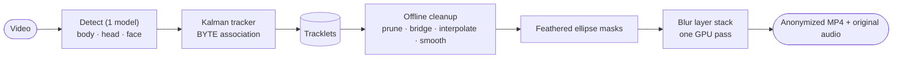

<div align="center">

# Automated Video Privacy Pipeline

On-device head anonymization for video: detect, track, clean up offline, blur.
Comes with a live inspector for tuning every step before you export.

[](LICENSE)
[](pyproject.toml)
[](src/ui.py)
[](src/libs/utils.py)
[](#privacy-by-design)


</div>

---

This tool finds every head in a video, follows it across frames, and paints an
irreversible Gaussian and mosaic blur over it, entirely on your machine.
Nothing is uploaded, ever.

## Features

- **Whole-head coverage at any angle.** One detector (PINTO YOLOv9-Wholebody17)
  finds bodies, heads and faces in a single pass. The head class is trained on
  all 360° orientations — back of head, profile, top-down, lying sideways — so
  the person stays anonymous even when no face is visible. Optional **rotation
  assist** re-detects on ±90°-rotated frames to recover sideways heads in bed
  angles.
- **Two-pass export with hindsight.** Pass 1 detects and tracks; the tracklets
  are then cleaned *offline* — false positives pruned, detection gaps bridged
  and interpolated along the head's path, positions smoothed with zero lag —
  and pass 2 renders the blur from the cleaned table. No flicker, no ghost
  blurs frozen at stale positions, no missed re-entries.
- **Real tracking.** A constant-velocity Kalman filter per head with
  BYTE-style two-stage association: low-confidence detections keep a blur
  alive through occlusion but can never start one, and a new blur needs
  several consecutive hits — one-frame false positives never flash.
- **Consistent, tight masks.** Every head gets the same shape every frame: a
  padded ellipse with a feathered edge. No hull/box popping, no giant safety
  margins.
- **Three-panel live inspector.** Before, Tracking, and After side by side.
  The Tracking panel shows the raw evidence live: body boxes, head detections
  (green = confident, grey = sustain-only), faces, pseudo-heads, and the
  Kalman tracks with their state.
- **Stackable blur layers.** Add, remove and reorder Gaussian and pixelate
  passes. Mask padding, feather and the blur stack stay live-tunable even
  during the render pass.
- **Audio preserved.** The source audio track is stream-copied into the
  export — no re-encode, no cost.
- **GPU where it helps.** ONNX Runtime picks DirectML (AMD RX 6800), then
  CUDA, then CPU automatically; the blur runs on OpenCL/UMat on AMD.

## How it works



The export runs **two passes**. The analysis pass runs the detector on every
frame and records the Kalman tracks. Between passes the tracklets are cleaned
with knowledge a live tracker can never have — the future: coasted guesses are
trimmed, short low-confidence tracklets are dropped, a head that vanishes and
reappears nearby is re-joined with the gap *interpolated along its path*
(gated so two close heads can never be smeared into one), and the trajectory is
smoothed with a zero-phase filter. The render pass then just paints masks from
that table and encodes — no inference, so it's fast and deterministic.

The live preview runs the same detector and tracker in streaming mode. It is
deliberately approximate: the exported file always gets the extra offline
cleanup, so the export is strictly better than the preview.

See [docs/DATAFLOW.md](docs/DATAFLOW.md) for the full dataflow.

## Install

Requires Python 3.12+ and [uv](https://docs.astral.sh/uv/).

```bash
git clone <this-repo>
cd automated-video-privacy-pipeline
uv sync
```

> First run downloads the detector model (~28 MB extracted from the PINTO
> model zoo archive) to `~/.cache/avpp/detector/`. The Windows .exe bundles it,
> so the .exe never downloads anything. Everything is fully offline after that.

### GPU acceleration (AMD RX 6800, NVIDIA, Intel)

Inference runs through ONNX Runtime, which picks the best execution provider
automatically: **DirectML** (any Windows GPU, including AMD Radeon) → CUDA →
ROCm → CPU. On an **AMD RX 6800** the fast path is **DirectML on Windows** —
the default `onnxruntime` wheel is CPU-only, so install the DirectML build:

```bash
uv pip uninstall onnxruntime
uv pip install onnxruntime-directml      # Windows + any GPU (AMD/NVIDIA/Intel)
```

The blur stack is GPU-accelerated too: OpenCV's OpenCL/UMat path on AMD and
Intel (PyTorch CUDA on NVIDIA when installed). The debug log
(`%TEMP%\FaceBlurInspector-debug.log`) records the resolved provider — look
for `detector ready on DmlExecutionProvider`.

## Quick start

```bash
uv run python src/main.py
```

1. **Open Video** and scrub the timeline. All three panels update live.
2. Pick a **preset**, or open **Advanced** and drag sliders; the current
   frame re-renders so you can judge the result immediately.
3. **Export**: pass 1 analyses (watch the Tracking panel), pass 2 renders.
   **Pause** any time; mask padding, feather and blur layers apply live even
   during rendering.

### Presets

| Preset | Use it for |
| --- | --- |
| **Balanced** | Sensible defaults for most footage |
| **Max Privacy** | Catch every head and blur hard; favours coverage over precision |
| **Strict** | Fewer false blurs: higher confidence bar, shorter gap bridging |

Touch any slider and the chips deselect: you're in **custom** territory.

## Tuning guide

### Detection

| Tunable | Default | What it does |
| --- | --- | --- |
| **Confidence** | 0.50 | A head detection at or above this can start and drive a blur. *Lower* to catch more heads; the tracker and offline cleanup absorb most of the extra noise. |
| **Sustain floor** | 0.10 | Detections between this and Confidence only *sustain* an existing blur through occlusion — they can never start one. |
| **Rotation Assist** | on | Also detect on ±90°-rotated frames — recovers sideways heads (lying down, bed angles) at ~3× the detection cost. |

### Tracking · Cleanup

| Tunable | Default | What it does |
| --- | --- | --- |
| **Confirm frames** | 3 | Consecutive detections before a new head is blurred. Kills one-frame false positives; the export's end-extension repairs the onset. |
| **Min track (s)** | 0.25 | Export cleanup: tracklets with fewer hits are detector noise and are dropped. |
| **Bridge gap (s)** | 1.5 | Export cleanup: a head that vanishes and reappears within this window is re-joined, the gap blurred along its interpolated path. |
| **Coast (s)** | 1.75 | How long a lost track stays alive as a re-acquire/bridge candidate (never blurred while coasting). |
| **Smooth (s)** | 0.5 | Zero-phase smoothing window for the blur's position and size. |

### Blur

| Tunable | Default | What it does |
| --- | --- | --- |
| **Mask Pad** | 0.18 | How far the ellipse extends beyond the detected head box, per side. |
| **Edge Feather** | 0.12 | Soft fade at the mask edge, as a fraction of head size. |
| **Layer Stack** | Gaussian 71 → Pixelate 10 | Ordered blur passes. Gaussian strength is the kernel size (3–151, odd); Pixelate is the mosaic cell size (2–40). |

### Recipes

- **Heads slipping through?** Confidence `0.35`, Confirm frames `2`, Bridge
  gap `2.5` — that's the *Max Privacy* preset.
- **Something blurred that isn't a head?** Confidence `0.60`, Confirm frames
  `5`, Min track `0.4` — that's *Strict*.
- **Identity still readable after blur?** Raise Pixelate before Gaussian.
  Mosaic size is what defeats deblurring; the Gaussian only feeds it.
- **Blur box looks loose?** Mask Pad down to `0.10`; keep some Edge Feather so
  residual jitter stays invisible.

## Windows build

`build_exe.sh` produces a standalone `dist/FaceBlurInspector.exe` (single
file, no console window, detector model bundled). Run it from WSL2; it drives
the Windows Python interpreter through WSL interop:

```bash
./build_exe.sh
```

You need a Windows Python 3.10–3.13 on the host. The build force-installs
**onnxruntime-directml** last so inference runs on the GPU, and its smoke test
asserts `DmlExecutionProvider` is present — a CPU-only bundle fails loudly
instead of shipping. `test_pipeline_win.py` is a standalone smoke test you can
run against the repo with Windows Python.

## Privacy by design

- All inference and rendering happen locally; the network is only touched to
  fetch the detector model once (and never by the .exe, which bundles it).
- Blur is destructive (a flat-color mosaic over a Gaussian wash), not a
  reversible filter.
- The cleanup pass errs on the side of coverage: detection gaps are bridged
  and interpolated, track ends are extended, and interpolated segments get
  extra padding.

## Project structure

```
src/
  main.py            entry point; shows the splash, hands off to the GUI
  splash.py          lightweight splash screen shown while heavy imports load
  ui.py              the inspector (PyQt6): presets, panels, two-pass export
  libs/
    detector.py      single ONNX detector (body/head/face) + rotation assist
    head_tracker.py  Kalman + BYTE association + Hungarian assignment
    tracklets.py     pass-1 recording + offline cleanup → render table
    models.py        startup preflight: locate/download the detector
    utils.py         providers, fp16, feathered masks, GPU blur stack
    video_writer.py  streaming ffmpeg exporter (>4 GiB safe, audio copy)
scripts/
  capture_screenshots.py   regenerates the README screenshots, headless
test_pipeline_win.py       Windows/DirectML smoke test (run with py.exe)
build_exe.sh         standalone Windows .exe via PyInstaller (run from WSL2)
```

## Contributing

Issues and PRs welcome. `uv sync`, make your change, and include a screenshot
if it touches the UI. `scripts/capture_screenshots.py` regenerates the full
set headlessly:

```bash
QT_QPA_PLATFORM=offscreen uv run python scripts/capture_screenshots.py
```

## License

[MIT](LICENSE) © 2026 Kabir S. Tamari

The default detector model (YOLOv9-Wholebody17 from the
[PINTO model zoo](https://github.com/PINTO0309/PINTO_model_zoo)) is GPLv3 and
is downloaded/bundled as data, not linked; the Apache-2.0
YOLOX-Body-Head-Hand-Face spec is available via `AVPP_DETECTOR=yolox_bhhf`.

The [NudeNet](https://github.com/notAI-tech/NudeNet) verify-witness model
(`libs/nudenet.py`, offline-only — a second opinion during export's tracklet
verification, never in the live per-frame path) is AGPL-3.0 and is likewise
downloaded/bundled as data, not linked. This matters only if you redistribute
a build of this app; personal/offline use is unaffected.
