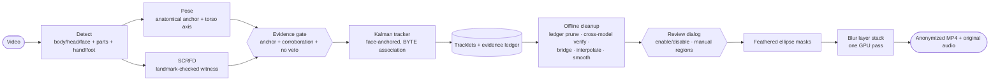

<div align="center">

# Automated Video Privacy Pipeline

On-device head anonymization for video: detect, track, clean up offline, blur.
Comes with a live inspector for tuning every step before you export.

[](LICENSE)
[](pyproject.toml)
[](src/ui.py)
[](src/libs/utils.py)
[](#privacy-by-design)


</div>

---

This tool finds every face in a video, follows it across frames, and paints an
irreversible Gaussian and mosaic blur over it, entirely on your machine.
Nothing is uploaded, ever.

Built for footage where a plain face detector false-positives constantly —
heavy skin exposure, extreme close-ups, unusual poses. The pipeline's core
rule is **precision-first**: a region only gets blurred once it clears an
evidence gate (anatomical anchoring + independent-model corroboration + no
contradicting evidence); a face-shaped region that can't clear that bar is
left alone rather than guessed at. See [How it works](#how-it-works) for why
that's a harder problem than it sounds, and [docs/DATAFLOW.md](docs/DATAFLOW.md)
for the full per-stage dataflow.

## Features

- **Evidence-gated face detection, not a raw confidence threshold.** A face
  claim only becomes a blur candidate when it is anatomically anchored (inside
  an independently detected head box, or on the head side of a pose-derived
  torso axis) **and** corroborated by a second cue (an eye/nose/mouth
  detection, SCRFD's landmark-checked witness, or confident pose keypoints)
  **and** not vetoed by a contradicting hand/foot detection covering it. This
  is what stops "face-shaped skin" (a sock, a knee, a shoulder) from being
  blurred — raising a plain confidence threshold can't tell those apart from
  a real face, no matter how high you set it.
- **Face-only blur by default.** The default blur target is the matched face
  (plus a fringe of hair), not the whole head — tighter, less obtrusive
  coverage. Whole-head mode is still available for maximum coverage.
  Optional **rotation assist** re-detects on ±90°-rotated frames to recover
  sideways heads in bed angles.
- **Two-pass export with hindsight, plus a review step.** Pass 1 detects,
  poses and tracks; the tracklets are then cleaned *offline* — a composite
  prune (length/score/hit-ratio **and** an evidence ledger), cross-model
  re-verification against an independent witness, gap bridging with path
  interpolation, zero-phase smoothing — and you get a **review dialog**
  before anything renders: enable/disable individual tracks, or draw a
  manual blur region over anything the pipeline missed. Pass 2 then renders
  from that decision. No flicker, no ghost blurs frozen at stale positions,
  no missed re-entries, and no track blurs without your final say.
  Analysis results are cached in a sidecar file next to the source, so a
  re-export that only tweaks cleanup knobs (bridge gap, smoothing, blur
  region) skips the expensive analysis pass entirely.
  See [Review dialog](#review-dialog-before-render).
- **Real tracking.** A constant-velocity Kalman filter per track with
  BYTE-style two-stage association: low-confidence detections keep a blur
  alive through occlusion but can never start one, and a new blur needs
  several consecutive hits — one-frame false positives never flash.
- **Consistent, tight masks.** Every blur target gets the same shape every
  frame: a padded ellipse with a feathered edge. No hull/box popping, no
  giant safety margins.
- **Three-panel live inspector.** Before, Tracking, and After side by side.
  The Tracking panel shows the full evidence chain live: body/head/face
  boxes, eye/nose/mouth part hits, hand/foot veto evidence, the pose
  skeleton and its head anchor, SCRFD's witness faces, every claim the gate
  rejected (tagged with why), and the Kalman tracks with their state.
- **Stackable blur layers.** Add, remove and reorder Gaussian and pixelate
  passes. Mask padding, feather and the blur stack stay live-tunable even
  during the render pass.
- **Audio preserved.** The source audio track is stream-copied into the
  export — no re-encode, no cost.
- **GPU where it helps.** ONNX Runtime picks DirectML (AMD RX 6800), then
  CUDA, then CPU automatically; the blur runs on OpenCL/UMat on AMD.

## How it works



A single face detector's confidence score cannot tell "face-shaped skin"
apart from an actual face — raising the threshold only trades one kind of
mistake for the other. So no detection is a blur target by itself: the
**evidence gate** (`libs/evidence.py`) only promotes a face claim to a blur
candidate once it clears anatomical anchoring, a second independent cue, and
an unresolved-veto check (see Features above). Everything the primary
detector, SCRFD and the pose model produce is evidence for that gate, never
a box painted straight onto the video.

The export runs **two passes**. Pass 1 runs the full evidence chain on every
frame and records the Kalman tracks plus each frame's evidence flags. Between
passes, the tracklets are cleaned with knowledge a live tracker can never
have — the future: a composite prune drops tracklets that are short/low-score
*or* whose evidence ledger never accumulated real anatomical backing (the
"long, confident, and reproduces every frame" signature of a static
skin/fabric misread — length and score alone can't catch that, the ledger
can), survivors are re-verified against an **independent** model (never the
one that produced them, so a hallucination can't confirm itself), gaps are
bridged and interpolated along the path, and positions are smoothed with a
zero-phase filter. You then get a **review dialog** to enable/disable
individual tracks or draw manual regions before pass 2 renders from that
decision — see below.

The live preview runs the same detection/gate/tracking chain in streaming
mode, without the offline cleanup, cross-model verify, or review step. It is
deliberately approximate: the exported file always gets the full pipeline, so
the export is strictly better than the preview.

See [docs/DATAFLOW.md](docs/DATAFLOW.md) for the full dataflow and a
per-stage tech table.

### Review dialog (before render)

Between analysis and render, a dialog lists every track the pipeline found —
kept and rejected alike, worst grade first — with its time range, evidence
grade ("A"/"B"/"C") and a thumbnail. Uncheck a track to exclude it from the
render (a false positive that still slipped through), or re-check a rejected
one the pipeline dropped too aggressively. A second panel lets you scrub the
video, drag out a rectangle, and mark it as the start/end keyframe of a
**manual blur region** — for anything the pipeline never detected at all.
Your decisions are saved into the sidecar file next to the source, so
re-opening the same export later restores them.

## Install

Requires Python 3.12+ and [uv](https://docs.astral.sh/uv/).

```bash
git clone <this-repo>
cd automated-video-privacy-pipeline
uv sync
```

> First run downloads four small ONNX models (detector ~28 MB, SCRFD ~17 MB,
> pose ~25 MB, NudeNet verify witness ~12 MB — ~82 MB total) into
> `~/.cache/avpp/`. The Windows .exe bundles all four, so the .exe never
> downloads anything. Everything is fully offline after that.

### GPU acceleration (AMD RX 6800, NVIDIA, Intel)

Inference runs through ONNX Runtime, which picks the best execution provider
automatically: **DirectML** (any Windows GPU, including AMD Radeon) → CUDA →
ROCm → CPU. On an **AMD RX 6800** the fast path is **DirectML on Windows** —
the default `onnxruntime` wheel is CPU-only, so install the DirectML build:

```bash
uv pip uninstall onnxruntime
uv pip install onnxruntime-directml      # Windows + any GPU (AMD/NVIDIA/Intel)
```

The blur stack is GPU-accelerated too: OpenCV's OpenCL/UMat path on AMD and
Intel (PyTorch CUDA on NVIDIA when installed). The debug log
(`%TEMP%\FaceBlurInspector-debug.log`) records the resolved provider — look
for `detector ready on DmlExecutionProvider`.

## Quick start

```bash
uv run python src/main.py
```

1. **Open Video** and scrub the timeline. All three panels update live.
2. Pick a **preset**, or open **Advanced** and drag sliders; the current
   frame re-renders so you can judge the result immediately.
3. **Export**: pass 1 analyses (watch the Tracking panel), then a
   [review dialog](#review-dialog-before-render) opens — enable/disable
   tracks or draw manual regions, then **Render** to run pass 2. **Pause**
   any time during either pass; mask padding, feather and blur layers apply
   live even during rendering.

### Presets

| Preset | Use it for |
| --- | --- |
| **Balanced** | Sensible defaults for most footage |
| **Max Privacy** | Catch every face and blur hard; favours coverage — bought via a looser evidence profile and longer holds, never a lower confidence bar |
| **Strict** | Fewest false blurs: higher confidence bar, the strictest evidence profile (no unverified tracks survive), shorter gap bridging |

Touch any slider and the chips deselect: you're in **custom** territory.

## Tuning guide

### Detection

| Tunable | Default | What it does |
| --- | --- | --- |
| **Confidence** | 0.50 | A *gated* face candidate at or above this can start and drive a blur. This floor never moves for coverage — see Evidence profile below; lowering it back to trusting raw detector score is exactly the failure mode this pipeline exists to avoid. |
| **Sustain floor** | 0.10 | Detections between this and Confidence only *sustain* an existing blur through occlusion — they can never start one. |
| **Evidence profile** | Balanced | Key into `libs/evidence.py`'s `PROFILES`: how much anatomical/consensus evidence a face candidate needs to clear the gate and, offline, the ledger. `balanced` requires a part/landmark hit; `max` relaxes that when pose-anchored (for coverage); `strict` requires more and never trusts an unverified track. |
| **Rotation Assist** | on | Also detect on ±90°-rotated frames — recovers sideways heads (lying down, bed angles) at ~3× the detection cost. |

### Tracking · Cleanup

| Tunable | Default | What it does |
| --- | --- | --- |
| **Confirm frames** | 3 | Consecutive hits before a new track may blur. Kills one-frame false positives; the export's end-extension repairs the onset. |
| **Min track (s)** | 0.25 | Export cleanup: tracklets with fewer hits are detector noise and are dropped (subject also to the evidence ledger — see Evidence profile). |
| **Bridge gap (s)** | 1.5 | Export cleanup: a track that vanishes and reappears within this window is re-joined, the gap blurred along its interpolated path. |
| **Coast (s)** | 1.75 | How long a lost track stays alive as a re-acquire/bridge candidate (never blurred while coasting). |
| **Smooth (s)** | 0.5 | Zero-phase smoothing window for the blur's position and size. |
| **Face Hold (s)** | 0.8 | How long a track's last matched face keeps steering the face-only blur (or may be interpolated across, in export) before falling back to the wider head box / being reported as a genuine coverage gap. |
| **Blur region** | Face only | "Face only" blurs the matched face plus a fringe of hair; "Whole head" blurs the full tracked head-scale box — biggest, safest, never loses coverage when face evidence is momentarily missing. |

### Blur

| Tunable | Default | What it does |
| --- | --- | --- |
| **Mask Pad** | 0.18 | How far the ellipse extends beyond the blur-target box, per side. |
| **Edge Feather** | 0.12 | Soft fade at the mask edge, as a fraction of the target's size. |
| **Layer Stack** | Gaussian 71 → Pixelate 10 | Ordered blur passes. Gaussian strength is the kernel size (3–151, odd); Pixelate is the mosaic cell size (2–40). |

### Recipes

- **Faces slipping through?** Evidence profile `max`, Confirm frames `2`,
  Bridge gap `2.5`, Face Hold `1.5s` — that's the *Max Privacy* preset. The
  confidence floor stays put; coverage comes from evidence leniency and
  longer holds instead.
- **Something blurred that isn't a face?** Confidence `0.60`, Evidence
  profile `strict`, Confirm frames `5`, Min track `0.4` — that's *Strict*.
- **Identity still readable after blur?** Raise Pixelate before Gaussian.
  Mosaic size is what defeats deblurring; the Gaussian only feeds it.
- **Blur box looks loose?** Mask Pad down to `0.10`; keep some Edge Feather so
  residual jitter stays invisible.
- **A specific track is a false positive despite everything?** Don't retune
  globally — disable it in the [review dialog](#review-dialog-before-render)
  instead; that's a per-track override, not a threshold change.

## Windows build

`build_exe.sh` produces a standalone `dist/FaceBlurInspector.exe` (single
file, no console window, all four models bundled). Run it from WSL2; it
drives the Windows Python interpreter through WSL interop:

```bash
./build_exe.sh
```

You need a Windows Python 3.10–3.13 on the host. The build force-installs
**onnxruntime-directml** last so inference runs on the GPU, and its smoke test
asserts `DmlExecutionProvider` is present — a CPU-only bundle fails loudly
instead of shipping. `test_pipeline_win.py` is a standalone smoke test you can
run against the repo with Windows Python.

## Privacy by design

- All inference and rendering happen locally; the network is only touched to
  fetch the four small models once (and never by the .exe, which bundles
  them all).
- Blur is destructive (a flat-color mosaic over a Gaussian wash), not a
  reversible filter.
- Precision-first: a face-shaped region that can't clear the evidence gate
  is left unblurred rather than guessed at, and the review dialog gives you
  the final say over every track before anything renders.
- The cleanup pass errs on the side of coverage for tracks that *do* clear
  the gate: detection gaps are bridged and interpolated, track ends are
  extended, and interpolated segments get extra padding.

## Project structure

```
src/
  main.py            entry point; shows the splash, hands off to the GUI
  splash.py          lightweight splash screen shown while heavy imports load
  ui.py              the inspector (PyQt6): presets, panels, two-pass export
  review_ui.py       review dialog: track enable/disable, manual regions
  libs/
    detector.py      ONNX detector — body/head/face/parts/hand-foot, rotation assist
    evidence.py      face-candidate acceptance gate + offline evidence ledger
    scrfd.py         landmark-checked witness face detector (runs every frame)
    pose.py          RTMPose body estimator — anatomical anchor + torso axis
    nudenet.py       independent, offline-only cross-model verify witness
    sidecar.py       analysis cache + review-decision persistence (.avpp.json)
    head_tracker.py  Kalman + BYTE association + Hungarian assignment
    tracklets.py     pass-1 recording + offline cleanup → render table
    models.py        startup preflight: locate/download all four models
    utils.py         providers, fp16, feathered masks, GPU blur stack
    video_writer.py  streaming ffmpeg exporter (>4 GiB safe, audio copy)
scripts/
  capture_screenshots.py   regenerates the README screenshots, headless
test_pipeline_win.py       Windows/DirectML smoke test (run with py.exe)
build_exe.sh         standalone Windows .exe via PyInstaller (run from WSL2)
```

## Contributing

Issues and PRs welcome. `uv sync`, make your change, and include a screenshot
if it touches the UI. `scripts/capture_screenshots.py` regenerates the full
set headlessly:

```bash
QT_QPA_PLATFORM=offscreen uv run python scripts/capture_screenshots.py
```

## License

[MIT](LICENSE) © 2026 Kabir S. Tamari

The default detector model (YOLOv9-Wholebody17 from the
[PINTO model zoo](https://github.com/PINTO0309/PINTO_model_zoo)) is GPLv3 and
is downloaded/bundled as data, not linked; the Apache-2.0
YOLOX-Body-Head-Hand-Face spec is available via `AVPP_DETECTOR=yolox_bhhf`.

The [NudeNet](https://github.com/notAI-tech/NudeNet) verify-witness model
(`libs/nudenet.py`, offline-only — a second opinion during export's tracklet
verification, never in the live per-frame path) is AGPL-3.0 and is likewise
downloaded/bundled as data, not linked. This matters only if you redistribute
a build of this app; personal/offline use is unaffected.

The [RTMPose](https://github.com/open-mmlab/mmpose) body pose model
(`libs/pose.py`) is Apache-2.0 and downloaded/bundled as data the same way.
