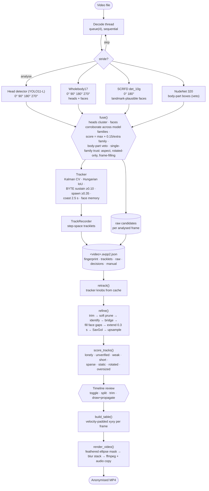

# Pipeline Dataflow

End-to-end path of one video through the union pipeline, stage by stage,
with the module responsible for each. The GUI (`src/app/`) and the CLI
(`src/cli.py`) drive exactly the same functions (`src/pipeline/session.py`).

The design has two cost tiers. **Detection** (pass 1) is the only expensive
thing and runs once per video; its per-frame output is cached. **Everything
else** — tracking, refinement, scoring, table building, rendering — runs from
that cache in seconds, so every knob except the detection set can be
changed and re-applied without re-detecting.

## Diagram

## Stage-by-stage

| # | Stage | Where | What happens |
| --- | --- | --- | --- |
| 1 | Decode | `pipeline/analysis.py:_decode_thread` | Sequential decode on a thread into a 4-deep queue; frames not on the stride are counted and dropped. |
| 2 | Detect | `analysis.py:detect_frame` | Head detector on each configured rotation (`libs/headdet.py`), Wholebody17 heads + faces per rotation (`libs/detector.py`), SCRFD faces per rotation filtered by `kps_plausible` (`libs/scrfd.py`), and NudeNet's non-face classes as body-part boxes (`libs/nudenet.py`, one 320 px pass). Rotated boxes are mapped back with `geom.unrotate_boxes`. Every source's boxes are cached in the sidecar. |
| 3 | Fuse | `pipeline/fuse.py:fuse` | **Heads define geometry, faces corroborate.** Head claims (head detector, Wholebody head) cluster greedily by score (IoU ≥ 0.45 or centre containment within a 0.45–1.8× area ratio); the cluster box is the score-weighted mean. Each face (SCRFD, Wholebody face) attaches to the head cluster that contains its centre and is under 8× its area, adding its source bit and, if it comes from a *different model family*, `FACE_IN_HEAD` — a face never changes a cluster's box (a face grown to head scale is larger than a close-up head and used to spawn torso-sized duplicates). Faces nothing covers become head-sized claims via `geom.grow_to_head` (×1.35 wide, ×1.55 tall). Score = best member (faces × 0.9) + 0.15 per extra **family** (head detector / Wholebody / SCRFD — Wholebody's head and face classes are one network, one family). When a cluster exceeds 1.5× its attached face's grown area, its box is pulled halfway toward the face. A candidate that coincides with a NudeNet body-part box (IoU ≥ 0.45, 70 % inside one, or a part of ≥ 10 % its area lying inside it) is flagged `BODYPART` unless a cross-family face corroborates it; by default the flag only feeds the `bodypart` suspicion component (`bodypart_weight = 1.0`), because suppressing spawn measured three points of head coverage lost for a dozen fewer unsupported boxes — the *Strict* preset sets 0.3 and actually vetoes. Single-family claims without a cross-family face are scaled by source trust (Wholebody ×0.7) and lose more weight when frame-filling (×0.5 over 30 %), oddly shaped (×0.5 outside 0.45–2.2 aspect) or rotated-only (×0.7); a rotated-only single-family claim over 30 % of the frame is dropped. |
| 4 | Track | `pipeline/tracker.py:Tracker.update` | Constant-velocity Kalman per track. Stage 1: Hungarian on IoU ≥ 0.15 with candidates ≥ `spawn_conf`, sizes within 0.5–2× the track's. Stage 2 (BYTE): recently-alive leftovers × candidates ≥ `sustain_conf` at IoU ≥ 0.25 and sizes within 0.6–1.7× (flagged `SUSTAIN`) — the size gates stop a torso-sized weak box, whose IoU with the head it contains can clear the bar, from dragging the Kalman box up to torso size. Stage 3: unmatched confirmed tracks × leftovers by centre distance under one diagonal with a size gate. Unconfirmed tracks die after one miss; confirmed ones coast `max_age_s`. Raw faces refresh a per-track face box stored relative to the head. |
| 5 | Record | `pipeline/record.py` | Per-frame observations → contiguous step-space `Tracklet`s (six channels). |
| 6 | Persist | `pipeline/project.py` | Sidecar keyed by file size+mtime and the *detection* fingerprint (`AnalysisConfig.fingerprint()`, which excludes fusion and tracker knobs). Holds per-source detections, fused candidates and faces, tracklets, review overrides, manual heads, edits. |
| 7 | Re-fuse + re-track | `analysis.py:retrack` | Whenever the offline stages run, fusion and tracking are rebuilt from the cached per-source detections with the current knobs (seconds). |
| 8 | Refine | `pipeline/refine.py:refine` | **Trim** coasted ends. **Prune** only tracklets with no temporal support (one measurement; under 0.2 s with < 3 hits and no face evidence; < 20 % measured; top score < 0.2) — set aside, not deleted. **Identify** (ArcFace mean over face-evidence frames). **Bridge** gaps ≤ 2.5 s when the velocity-extrapolated landing point is within `diag × (0.75 + gap/gap_max)`, sizes within 0.5–2×, no other track in the corridor (IoU > 0.45), no near-equal competing join, and appearance does not veto (`cos < DIFF_ID_COS`); gap frames are `INTERP` with mid-gap padding. **Fill** face gaps ≤ 2 s. **Extend** 0.3 s each end. **Smooth** SavGol 0.3 s. **Upsample** to frame space; non-measured frames are `INTERP`, never hits. |
| 9 | Score | `pipeline/score.py` | Components in 0–1, weighted mean: lonely 0.25 (no `MULTI`/`FACE_IN_HEAD` ever), bodypart 0.25 (share of hits vetoed by a body-part box), unverified 0.15 (magnified re-detection by SCRFD + head detector on 5 crops; a re-detection inside the box counts only if it is at least 30 % of the box's area), oversized 0.12 (over 25 % of the frame), weak 0.08, short 0.05, sparse 0.05, static 0.03, rotated 0.02. `kept = suspicion < auto_disable_above`. Set-aside tracklets score ≥ 0.9 with their reason. |
| 10 | Review | `src/app/` | Lanes sorted by suspicion; alert strip = frames with a fused candidate ≥ `spawn_conf` that no blur box overlaps. Drawn boxes are propagated by `pipeline/propagate.py` (snap to cached candidates, else NCC template match, hold ≤ 6 frames). Decisions save to the sidecar with a 0.6 s debounce. |
| 11 | Table | `pipeline/render.py:build_table` | Enabled tracks (default `kept`, overridable) and manual heads → per-frame xyxy; face mode uses the bloomed face box where `fvalid` else the head box; every box grows by `motion_lead ×` its per-frame centre displacement. |
| 12 | Render | `render.py:render_video` | Decode thread → `libs/utils.render_head_mask` (padded feathered ellipse, ROI-limited blur) → `BlurPipeline.apply` (CUDA / OpenCL UMat / CPU) → `libs/video_writer` (ffmpeg, audio stream-copied, no `-shortest`). |

## Tech inventory

| Stage | Model / library | Input | Notes |
| --- | --- | --- | --- |
| Head detection | deepghs `head_detect_v0_l_yv11` (YOLO11-L, ONNX, 101 MB) | 640 letterbox, RGB /255 | `AVPP_HEADDET` picks n/s/m/l; raw `(1,5,N)` output decoded in numpy |
| Second head vote + faces | PINTO YOLOv9-S Wholebody17 (28 MB) | 640 resize, raw BGR | NMS baked in; head class trained on all orientations |
| Faces | InsightFace SCRFD det_10g (17 MB) | 640 (1280 in Max Privacy) letterbox | 5-point landmark plausibility filter kills skin/fabric misreads |
| Identity | InsightFace MobileFaceNet ArcFace (14 MB) | 112×112 aligned crops | veto only |
| Body-part veto | NudeNet YOLOv8n (12 MB, AGPL-3.0) | 320 letterbox | non-face classes veto head candidates at fusion; also `AVPP_*` switchable via `use_bodypart` |
| Runtime | ONNX Runtime; DirectML → CUDA → MIGraphX → ROCm → CPU | | providers verified by dlopen, fp16 derivative on GPU |
| Blur | OpenCV (OpenCL UMat) or PyTorch CUDA | | pixelate + Gaussian stack, one pass per frame |
| Encode | imageio-ffmpeg static ffmpeg | | H.264 CRF 18, audio copied |
