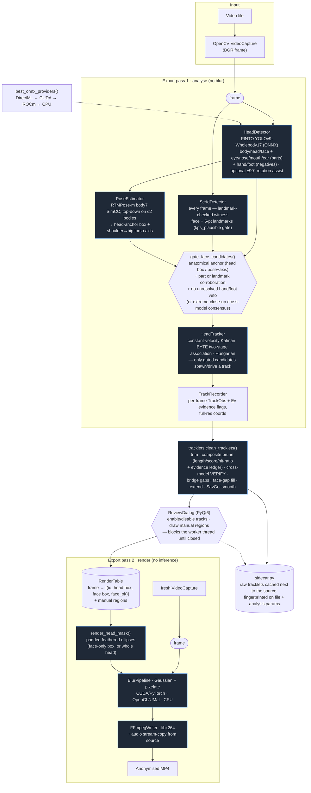

# Pipeline Dataflow

The Automated Video Privacy Pipeline anonymises faces in video with an
**evidence-gated, two-pass** design: no single detection is ever a blur
target by itself. Three lightweight ONNX models (a body/head/face/parts
detector, a landmark-checked witness face detector, and a body pose
estimator) all feed one acceptance gate; only a face claim that clears
anatomical anchoring, independent corroboration, and an unresolved-veto
check becomes a candidate a Kalman tracker may follow. Offline, a fourth
model (an independent, adult-content-trained witness) re-verifies every
surviving track before a review dialog gives you the final say, and only
then does the render pass paint blur.

Entry point [`src/main.py`](../src/main.py) shows the splash and hands off to
the PyQt6 inspector ([`src/ui.py`](../src/ui.py)) — the GUI is the sole entry
point.

## Diagram

The **live preview** runs the same detect → pose → gate → track chain as
pass 1 in streaming mode (confirmed tracks only, short hold) and blurs a
display-resolution copy — approximate by design, with no offline cleanup,
cross-model verify, or review step; the export's full pipeline is what the
written file gets.

## Stage-by-stage

| # | Stage | Tech | Source | Purpose |
|---|-------|------|--------|---------|
| 1 | Decode | OpenCV `VideoCapture` on a reader thread | [ui.py](../src/ui.py) | Read BGR frames; overlaps GPU inference |
| 2 | Detection | PINTO YOLOv9-Wholebody17 post-ONNX (ONNX Runtime) | [detector.py](../src/libs/detector.py) | One pass → body/head/face boxes, eye/nose/mouth/ear "part" hits, and hand/foot "negative" evidence. None of this is a blur target by itself — it is evidence for the gate. Optional ±90° rotated passes recover sideways heads, gated against hallucinations (score floor, absolute area cap, containment test, upright-witness corroboration) |
| 3 | Witness face detection | SCRFD det_10g (ONNX Runtime), every frame | [scrfd.py](../src/libs/scrfd.py) | Independent face + 5-point-landmark detector. Faces whose landmark geometry fails `kps_plausible` (a scattered/degenerate layout — fabric or skin misread as a face) are cut before the gate ever sees them; the rest are consensus/corroboration evidence, same as the primary's own face class |
| 4 | Pose | RTMPose-m body7 SimCC (ONNX Runtime), top-down on ≤2 bodies | [pose.py](../src/libs/pose.py) | 17 COCO keypoints per body → a coarse head-anchor box (oriented by the shoulder→hip torso axis, so a "head" on the hip side of the body — legs misread as a face — is rejected) and the axis itself, used to test whether a face claim sits on the correct side of the body |
| 5 | Evidence gate | Pure NumPy (`gate_face_candidates`) | [evidence.py](../src/libs/evidence.py) | The precision mechanism: a face claim becomes a blur candidate only when anatomically anchored (inside an independent head box, or on the head side of a pose-confirmed torso axis) **and** corroborated (an eye/nose/mouth hit, a landmark-checked SCRFD witness, or confident pose keypoints) **and** not vetoed by a hand/foot detection substantially covering it (unless strong evidence overrides the veto — a hand genuinely resting on a face is a real scene). An extreme-close-up path substitutes cross-model consensus (primary + SCRFD agreeing, at close-up scale) when there is no body/pose context to anchor to at all |
| 6 | Tracking | Constant-velocity Kalman + BYTE association + Hungarian (NumPy/SciPy) | [head_tracker.py](../src/libs/head_tracker.py) | Stable ids; only gated candidates may spawn or drive a track. Low-score, veto-passed detections sustain a track through occlusion but never spawn one; min-hits confirmation kills 1-frame false positives |
| 7 | Offline cleanup | `tracklets.clean_tracklets` (NumPy/SciPy + cross-model re-inference) | [tracklets.py](../src/libs/tracklets.py) | Trim coasted tails; **composite prune** — length/score/hit-ratio *and* an evidence ledger (a tracklet that never accumulates real anatomical/part backing is dropped regardless of score/length, which is what catches a static skin/fabric misread that reproduces every frame at high confidence); **cross-model VERIFY** — every survivor must be re-detected by an INDEPENDENT witness (SCRFD and/or NudeNet — never the primary detector that produced the track) on a magnified crop, or fall back to its evidence grade when no witness could run; bridge detection gaps with interpolation (corridor + ambiguity gates against identity smears); fill short face-evidence gaps separately from head bridging; zero-phase Savitzky-Golay smoothing |
| 7b | Cross-model witness | NudeNet YOLOv8n (ONNX Runtime), offline-only | [nudenet.py](../src/libs/nudenet.py) | An adult-content-trained detector with explicit `FACE_FEMALE`/`FACE_MALE` classes — a genuinely independent second opinion from a different training distribution than the primary/SCRFD, used only during VERIFY, never per-frame |
| 8 | Analysis cache | JSON sidecar, keyed on file identity + analysis params | [sidecar.py](../src/libs/sidecar.py) | Persists pass-1's raw tracklets (and review decisions) next to the source; a re-export with unchanged analysis-affecting params (confidence floors, evidence profile, rotation assist) skips pass 1 entirely, replaying cleanup-only changes (bridge gap, smoothing, blur region) from the cache |
| 9 | Review | PyQt6 modal dialog, GUI thread | [review_ui.py](../src/review_ui.py) | Every kept/rejected track, worst grade first, with a thumbnail — enable/disable any track, or draw a manual blur region (rubber-band + start/end keyframe, linearly interpolated). The export worker thread blocks on this via a `threading.Event` handshake (`ui.py`'s `review_ready`/`take_review_request`/`submit_review_decision`) since PyQt widgets can't run on a `QThread` |
| 10 | Masking | Padded feathered ellipses (OpenCV) | [utils.py](../src/libs/utils.py) `render_head_mask` | One consistent shape per blur target, every frame — no popping; feather hides jitter. Face-only mode skips any frame where face evidence isn't fresh rather than falling back to the head box |
| 11 | Blur | Gaussian + pixelate stack — CUDA/PyTorch · OpenCL/UMat · CPU | [utils.py](../src/libs/utils.py) `BlurPipeline` | One masked composite per frame; soft (alpha) compositing for feathered masks |
| 12 | Encode | FFmpeg libx264 via imageio-ffmpeg (cv2 fallback) | [video_writer.py](../src/libs/video_writer.py) | Source-bitrate-matched MP4, valid past 4 GiB; source audio stream-copied |

The ONNX execution provider is selected once by
[`best_onnx_providers()`](../src/libs/utils.py): **DirectML → CUDA → ROCm → CPU**.
Every model's session is created once and never destroyed, with its input
shape-pinned — both DirectML survival rules, applied identically across the
detector, SCRFD, pose and NudeNet.

## Tech inventory

- **Language / tooling:** Python 3.12, `uv`, PyInstaller (Windows .exe)
- **Detection:** PINTO model zoo 457_YOLOv9-Wholebody17 (`s` variant, ~28 MB,
  bundled into the exe); swappable via `AVPP_DETECTOR*` env vars
  (434_YOLOX-Body-Head-Hand-Face spec included)
- **Witness face detection:** insightface SCRFD det_10g (~17 MB, bundled),
  standalone ONNX wrapper (no insightface package); overridable via
  `AVPP_SCRFD*` env vars
- **Pose:** RTMPose-m body7 SimCC (~25 MB, bundled), standalone ONNX wrapper
  (no rtmlib/mmpose package); overridable via `AVPP_POSE*` env vars
- **Cross-model verify witness:** NudeNet YOLOv8n `320n.onnx` (~12 MB,
  bundled, sourced from the official PyPI wheel rather than the upstream
  GitHub release — see `libs/nudenet.py`'s module docstring); overridable via
  `AVPP_NUDENET*` env vars
- **Inference runtime:** ONNX Runtime (DirectML on the RX 6800 / CUDA / ROCm /
  CPU), fp32 by default (`AVPP_FP16` gates the fp16 derivative)
- **Numerics:** NumPy (Kalman, geometry, evidence gate), SciPy (Hungarian
  assignment, Savitzky-Golay)
- **Video I/O & blur:** OpenCV (`cv2`), OpenCL/UMat GPU blur path
- **Encoding:** FFmpeg / libx264 via imageio-ffmpeg, audio stream-copy
- **GUI:** PyQt6 (main inspector + the review dialog)
