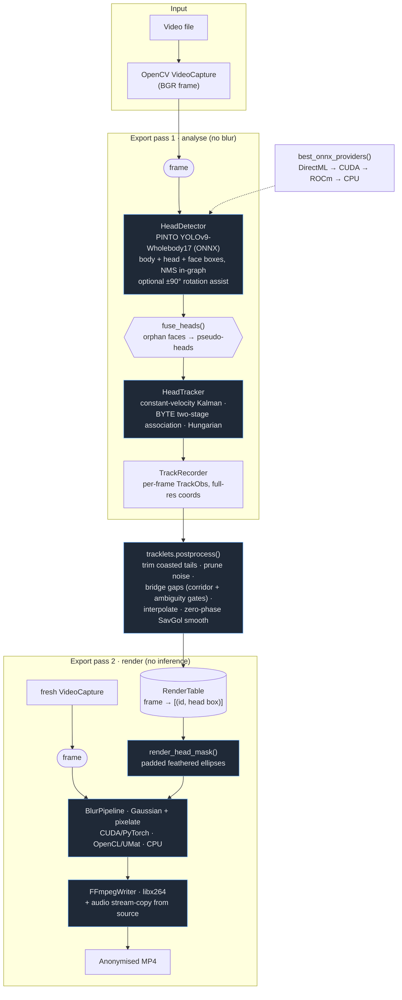

# Pipeline Dataflow

The Automated Video Privacy Pipeline anonymises heads in video with a
**single-detector, two-pass** design: one ONNX model finds body/head/face
boxes, a Kalman tracker links them over time, and the export renders blur from
an *offline-cleaned* track table — so the output is judged with hindsight, not
frame by frame.

Entry point [`src/main.py`](../src/main.py) shows the splash and hands off to
the PyQt6 inspector ([`src/ui.py`](../src/ui.py)) — the GUI is the sole entry
point.

## Diagram

The **live preview** runs the same detector + tracker as pass 1 in streaming
mode (confirmed tracks only, short hold) and blurs a display-resolution copy —
approximate by design; the export's offline cleanup is what the written file
gets.

## Stage-by-stage

| # | Stage | Tech | Source | Purpose |
|---|-------|------|--------|---------|
| 1 | Decode | OpenCV `VideoCapture` on a reader thread | [ui.py](../src/ui.py) | Read BGR frames; overlaps GPU inference |
| 2 | Detection | PINTO YOLOv9-Wholebody17 post-ONNX (ONNX Runtime) | [detector.py](../src/libs/detector.py) | One pass → body/head/face boxes. Head class covers all 360° orientations; optional ±90° rotated passes (gated against hallucinations) recover sideways heads |
| 3 | Head fusion | NumPy geometry (`fuse_heads`) | [detector.py](../src/libs/detector.py) | Faces with no covering head box grow a pseudo-head — recall backstop |
| 4 | Tracking | Constant-velocity Kalman + BYTE association + Hungarian (NumPy/SciPy) | [head_tracker.py](../src/libs/head_tracker.py) | Stable ids; low-score detections sustain tracks through occlusion but never spawn; min-hits confirmation kills 1-frame false positives |
| 5 | Offline cleanup | `tracklets.postprocess` (NumPy/SciPy) | [tracklets.py](../src/libs/tracklets.py) | Trim coasted tails, prune noise tracklets, bridge detection gaps with interpolation (corridor + ambiguity gates against identity smears), zero-phase Savitzky-Golay smoothing |
| 6 | Masking | Padded feathered ellipses (OpenCV) | [utils.py](../src/libs/utils.py) `render_head_mask` | One consistent shape per head, every frame — no popping; feather hides jitter |
| 7 | Blur | Gaussian + pixelate stack — CUDA/PyTorch · OpenCL/UMat · CPU | [utils.py](../src/libs/utils.py) `BlurPipeline` | One masked composite per frame; soft (alpha) compositing for feathered masks |
| 8 | Encode | FFmpeg libx264 via imageio-ffmpeg (cv2 fallback) | [video_writer.py](../src/libs/video_writer.py) | Source-bitrate-matched MP4, valid past 4 GiB; source audio stream-copied |

The ONNX execution provider is selected once by
[`best_onnx_providers()`](../src/libs/utils.py): **DirectML → CUDA → ROCm → CPU**.
The detector session is created once and never destroyed, with its input
shape-pinned — both DirectML survival rules.

## Tech inventory

- **Language / tooling:** Python 3.12, `uv`, PyInstaller (Windows .exe)
- **Detection:** PINTO model zoo 457_YOLOv9-Wholebody17 (`s` variant, ~28 MB,
  bundled into the exe); swappable via `AVPP_DETECTOR*` env vars
  (434_YOLOX-Body-Head-Hand-Face spec included)
- **Inference runtime:** ONNX Runtime (DirectML on the RX 6800 / CUDA / ROCm /
  CPU), fp32 by default (`AVPP_FP16` gates the fp16 derivative)
- **Numerics:** NumPy (Kalman, geometry), SciPy (Hungarian assignment,
  Savitzky-Golay)
- **Video I/O & blur:** OpenCV (`cv2`), OpenCL/UMat GPU blur path
- **Encoding:** FFmpeg / libx264 via imageio-ffmpeg, audio stream-copy
- **GUI:** PyQt6
