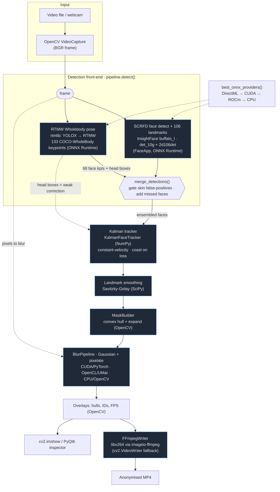

# Pipeline Dataflow

This is the end-to-end dataflow of the Automated Video Privacy Pipeline — the
**detect → track → smooth → mask → blur → encode** loop run once per frame.

Entry point [`src/main.py`](../src/main.py) dispatches to either the headless CLI
([`src/cli.py`](../src/cli.py)) or the PyQt6 inspector GUI
([`src/ui.py`](../src/ui.py)). Both share the detection front-end in
[`src/libs/pipeline.py`](../src/libs/pipeline.py).

> For component-level rationale and tuning notes, see
> [TECH_STACK.md](TECH_STACK.md). This document focuses on *how data moves*.

## Diagram

## Stage-by-stage

| # | Stage | Tech | Source | Purpose |
|---|-------|------|--------|---------|
| 1 | Decode | OpenCV `VideoCapture` | [cli.py](../src/cli.py) | Read BGR frames from file/webcam |
| 2a | Face detection | InsightFace SCRFD (`det_10g` + `2d106det`), ONNX Runtime | [face_app.py](../src/libs/face_app.py) | Face boxes + 106 landmarks; close-ups re-detected on a 1024px crop |
| 2b | Pose detection | rtmlib `Wholebody` (YOLOX → RTMW), ONNX Runtime | [pose_rtmw.py](../src/libs/pose_rtmw.py) | 133 keypoints → synthetic face dets (68 face kpts) + coarse head boxes |
| 2c | Ensemble | NumPy geometry (`merge_detections`) | [pipeline.py](../src/libs/pipeline.py) | Gate SCRFD against RTMW head regions (drop skin FPs unless conf ≥ 0.70); add faces SCRFD missed at odd angles |
| 3 | Tracking | Constant-velocity Kalman filter (NumPy) | [tracker.py](../src/libs/tracker.py) | Per-face state; pose head boxes are *weak* corrections that revive lost tracks; coasts up to `hold_secs` |
| 4 | Smoothing | Savitzky-Golay (SciPy) | [smoother.py](../src/libs/smoother.py) | De-jitter landmarks per track, hold on occlusion |
| 5 | Masking | Convex hull + expansion (OpenCV) | [utils.py](../src/libs/utils.py) `MaskBuilder` | Landmark-fitted polygon mask; coasting tracks reuse a remembered hull mapped onto the Kalman box |
| 6 | Blur | Gaussian + pixelate stack — CUDA/PyTorch · OpenCL/UMat · CPU/OpenCV | [utils.py](../src/libs/utils.py) `BlurPipeline` | One masked composite pass per frame |
| 7 | Overlay | OpenCV drawing | [cli.py](../src/cli.py) / [ui.py](../src/ui.py) | Hull outlines, track IDs, FPS |
| 8 | Encode / display | FFmpeg libx264 via imageio-ffmpeg (cv2 fallback) | [video_writer.py](../src/libs/video_writer.py) | Source-bitrate-matched MP4, valid past 4 GiB; live preview via `cv2.imshow` / PyQt6 |

The ONNX execution provider for both detectors is selected once by
[`best_onnx_providers()`](../src/libs/utils.py): **DirectML → CUDA → ROCm → CPU**.

## Tech inventory

- **Language / tooling:** Python 3, `uv`
- **Video I/O & geometry:** OpenCV (`cv2`) — also the OpenCL/UMat blur path
- **Face detection + landmarks:** InsightFace `buffalo_l` (SCRFD `det_10g`,
  `2d106det`)
- **Pose estimation:** rtmlib `Wholebody` (YOLOX person detector + RTMW pose);
  MediaPipe Pose ([pose_head.py](../src/libs/pose_head.py)) remains as a legacy
  `--pose-backend mediapipe` option
- **Inference runtime:** ONNX Runtime (DirectML / CUDA / ROCm / CPU)
- **Numerics:** NumPy (Kalman tracker, geometry), SciPy (Savitzky-Golay)
- **Blur acceleration:** PyTorch (CUDA), OpenCV UMat (OpenCL), OpenCV (CPU)
- **Encoding:** FFmpeg / libx264 via imageio-ffmpeg
- **GUI:** PyQt6
